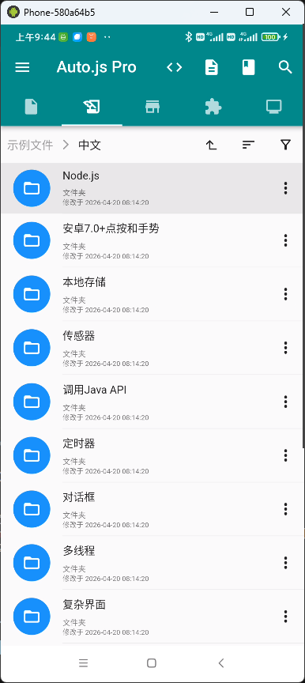
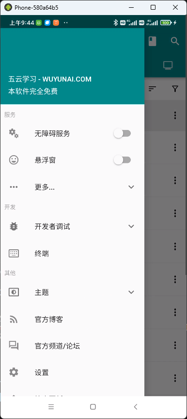

<p align="center">
  
</p>
<h1 align="center">AutoJsPro - 离线版</h1>
<h4 align="center">基于版本9.3.11-0 进行脱壳 去除校验 破解版</h4>

[](https://www.wuyunai.com)

[](https://www.wuyunai.com)

[](https://pro.autojs.run/docs) https://pro.autojs.run/docs

## 功能一览

| 功能                 | 说明                                                                 |
| -------------------- | -------------------------------------------------------------------- |
| 微信混淆控件适配     | 支持最新版微信混淆控件的识别与点击，完美支持打包。                   |
| 自定义无障碍服务类名 | 支持打包时自定义无障碍服务类名，适配特定应用的检测机制或白名单要求。 |
| 解除功能限制         | 默认解除所有主流大厂的控件点击限制。                                 |
| 支持电脑远程调试     | 通过VsCode远程连接，高效调试脚本。                                   |
| 完美热更新           | 支持网络加载JS代码、快照源码、工程Zip代码，灵活部署。                |

<p align="center">
  
  
</p>

# AutoJsPro Advanced Offline

AutoJsPro 反编译工程与一键打包脚本：

使用 **apktool** 回编、**zipalign** 对齐、**apksigner** 签名，并可选执行 **ApkDataMultiplexing** 优化与重签。

## 环境要求

| 依赖        | 说明                                                                                   |
| ----------- | -------------------------------------------------------------------------------------- |
| Python      | 3.10+（脚本使用 `Path \| None` 等语法）                                                |
| JDK         | 用于运行 `apktool.jar`、可选的 `ApkDataMultiplexing.jar`                               |
| Android SDK | 需安装 **build-tools**（内含 `zipalign`、`apksigner`），版本由脚本自动选取最新可用目录 |

建议设置环境变量（也可仅在 `config.json` 中配置 SDK 路径）：

- `ANDROID_SDK_ROOT` 或 `ANDROID_HOME`：指向 Android SDK 根目录

## 项目结构（摘要）

```
├── build.py              # 一键打包签名入口
├── config.json           # SDK / 密钥库路径与口令（勿提交敏感信息到公开仓库）
├── bin/
│   ├── apktool.jar       # 必须
│   └── ApkDataMultiplexing.jar   # 可选；不存在时跳过第 4 步优化
├── AutojsPro/            # 默认 apktool 反编译工程目录（可用 -i 指定其它目录）
└── AutoJsPro-signed.apk  # 默认最终输出（构建成功后生成于项目根目录）
```

## 配置说明（`config.json`）

| 字段            | 含义                                                             |
| --------------- | ---------------------------------------------------------------- |
| `android_sdk`   | Android SDK 根路径                                               |
| `keystore`      | 签名密钥库路径（可写相对项目根目录的文件名，如 `autojspro.jks`） |
| `keystore_pass` | 密钥库密码                                                       |
| `key_pass`      | 密钥密码                                                         |
| `key_alias`     | 密钥别名                                                         |

签名相关项也可通过环境变量覆盖（不写入配置文件时更安全）：

- `KEYSTORE_PASS` → 密钥库密码
- `KEY_PASS` → 密钥密码
- `KEY_ALIAS` → 密钥别名

## 构建命令

在项目根目录执行：

```bash
python build.py
```

常用参数：

| 参数              | 说明                                                   |
| ----------------- | ------------------------------------------------------ |
| `-i`, `--project` | apktool 工程目录，默认 `AutojsPro`                     |
| `-v`, `--verbose` | 打印 apktool 完整日志；**不加**时默认带 `-q`，减少刷屏 |

示例：

```bash
python build.py -i AutojsPro
python build.py -v
```

## 构建流程

1. **apktool 打包**：使用 `bin/apktool.jar` 将反编译目录打成未签名 APK。若存在 `<工程>/build` 缓存会先删除。
2. **zipalign 对齐**：优先 `-P 16`（16KB 页边界）；不支持时回退为 `-p 4`。
3. **apksigner 签名**：V1/V2/V3 由工具链默认处理。
4. **ApkDataMultiplexing**（可选）：若存在 `bin/ApkDataMultiplexing.jar` 则执行优化与重签；失败时回退为第 3 步已签名 APK 的副本。
5. **清理**：删除根目录下中间产物（如 `unsigned.apk`、`aligned.apk` 等）。

成功后在项目根目录生成 **`AutoJsPro-signed.apk`**。

## 常见问题

**提示找不到 build-tools**  
确认 `config.json` 中 `android_sdk` 正确，且已安装 Android SDK 的 **SDK Build-Tools**。

**需要查看 apktool 详细过程**  
使用 `python build.py -v`。

## 免责声明

1. **用途与合法性**  
   本仓库中的脚本、配置与说明仅作为技术学习与个人研究辅助。使用者须自行确保在所在地法律、目标软件许可协议及服务条款允许的范围内使用；因对 APK 进行反编译、修改、重打包、签名或分发而产生的任何法律风险与后果，均由使用者本人承担。

2. **与官方无关**  
   本仓库与 AutoJsPro 及其开发商、商标或官方渠道无关联；项目名称与内容若涉及第三方产品，仅用于描述技术上下文，不代表获得官方授权或背书。

3. **无担保**  
   仓库内容按「现状」提供，不作任何明示或暗示的保证（包括但不限于可用性、安全性、不侵权或适用于特定用途）。因使用或无法使用本仓库内容而造成的直接或间接损失，作者与贡献者不承担任何责任。

4. **安全与密钥**  
   签名密钥、配置文件中的口令及构建产物由使用者自行保管；请勿将真实密钥提交至公开仓库。因密钥泄露、误用签名或安装来源不明的 APK 导致的数据与设备风险，由使用者自行负责。

## 致谢

感谢 [L-JINBIN/ApkDataMultiplexing](https://github.com/L-JINBIN/ApkDataMultiplexing) 开源的 **APK 数据复用优化**（Data Multiplexing）方案与工具；本仓库可选的 `bin/ApkDataMultiplexing.jar` 即基于该项目思路，用于在过签包等场景下压缩与原始包重复资源带来的体积膨胀。原理与签名注意事项见上游仓库说明。

## 社区

QQ群: 1065375789

---

本仓库仅供学习交流使用，请遵守法律法规
